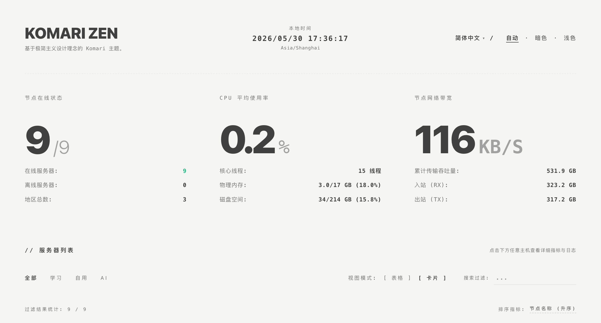

# Komari Zen

基于极简主义设计理念的 [Komari Monitor](https://github.com/komari-monitor/komari) 主题。

Gemini Flash 3.5 设计，Composer 2.5 实现。

## 预览

地址：https://k.kkkk.li

## 安装

1. 在 [Releases](https://github.com/qwer-xyz/komari-zen/releases) 下载最新的 `zen-theme.zip`
2. 进入 Komari 后台 → 主题管理 → 上传该 zip 并启用

## 技术栈

React 19 · TypeScript · Vite 6 · Tailwind CSS v4

## 鸣谢

* [Komari](https://github.com/komari-monitor/komari)
* [Komari Web](https://github.com/komari-monitor/komari-web)
* [React](https://react.dev/)
* [Vite](https://vite.dev/) 
* [Tailwind CSS](https://tailwindcss.com/) 

## 许可证

[MIT](./LICENSE)
